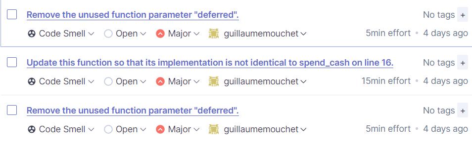
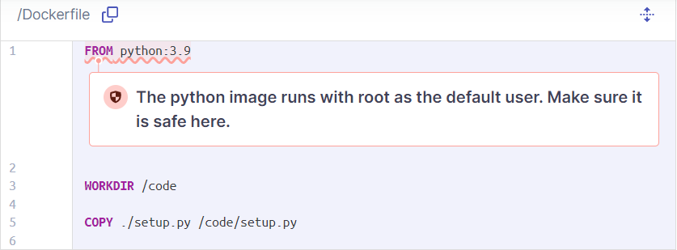

# Industrialisation

## TP 2 :

## Exo 1 Github Actions

### Quelles étapes (steps) sont réalisées par cette action ?

- Installation des dépendances
- Lint with flake (analyse de code)
- Mise en place de tests avec pytests

### Une étape est définie au minimum par 2 éléments, lesquels sont-ils et à quoi servent-ils ?

- Son nom pour pouvoir l'identifier
- Son action => le run pour l'ensemble des commandes

### La première étape contient le mot-clé ‘with’, a quoi sert-il ?

- Permet de définir la version dans laquelle on code notre projet

## Exo 2 SonarCloud

### Sur l’onglet Summary d’une analyse de code, SonarCloud fournit 4 indicateurs.

#### Quels sont-ils et quelles sont leurs utilités ?

Sonard Cloud nous défini directement les différents indicateurs.

- Bugs => Une erreur de code qui casse le projet et qui doit être réparé directement
- Code Smells => Un code difficile à comprendre et donc à tenir à jour
- Vulnerabilities => Faille de sécurité qui peuvent être exploitée par des hackers
- Security Hotspots => Code sensible sur la sécurité qui doit être vérifié manuellement pour évaluer la vulnérabilité.

### À quoi sert l’indicateur Quality Gate ?

- SonarCloud nous dit directement que "Une Quality Gate est un ensemble de conditions booléennes bassées sur des mesures. Cela aide à savoir directement si le projet est prêt pour la production. Dans le cas ou le status actuel n'est pas réussis, les mesures qui ont posés problème ainsi que les valeurs nécessaire pour réussir."

### Quelle est la différence entre les sections New code et Overall Code dans l’onglet Summary ?

- New Code test uniquement les nouveaux ajouts de code détecté depuis le dernier commit alors que Overall Code correspond à l'ensemble du code dans le projet.

### Y a-t-il des Code Smells ? Si oui, combien et pour quelle(s) raisons(s) ?

- Il y a 3 Code Smells
  

### Y a-t-il des Security Hotspots ? Si oui, combien et pour quelle(s) raison(s) ?

- Il y a 1 Security Hotspots
  
